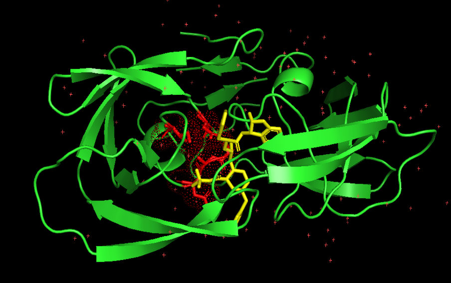
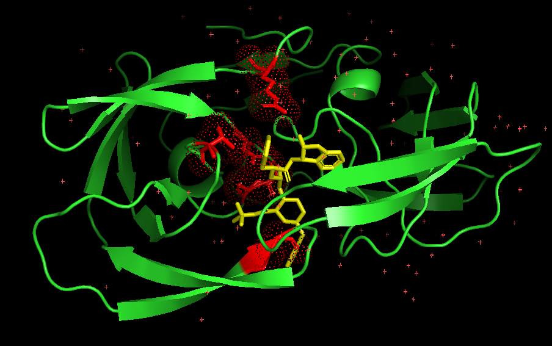
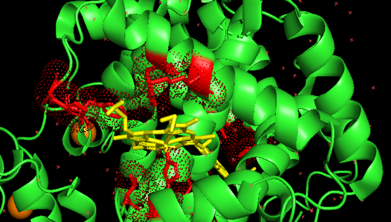
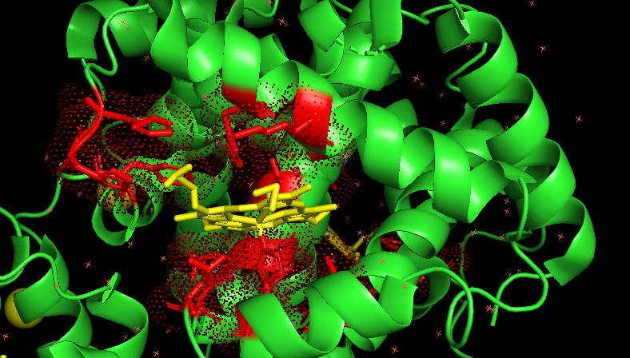
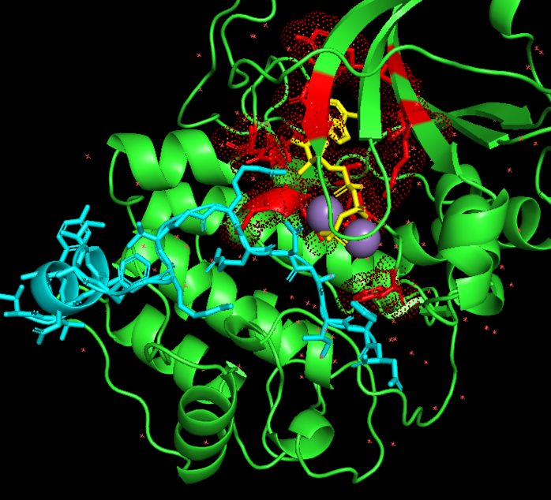
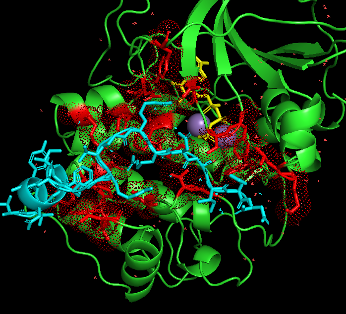

# Test

It should be noted that we have already tested several proteins during the creation of our deep learning model (see data/), as we always work with a test set. Despite this, we believe it is necessary to demonstrate that our approach works correctly with proteins that have not been used at any point during the entire development of our project.

To test our program we decided to use 3 different proteins. Our testing approach was as follows:
1) Use proteins of different sizes.
2) Use proteins with different ligands.
3) Use proteins from distantly related families.

That is why our chosen proteins are:

| PDB  | Protein Type          | Ligand Type                  | Size     |
|------|-----------------------|------------------------------|----------|
| 1HSG | Protease (homodimer)  | Small molecule inhibitor     | 200 aa  | 
| 4HHB | Transporter (tetramer)| Prosthetic group (heme)      | 574 aa  |
| 1ATP | Kinase (monomer)      | Nucleotide (ATP) + peptide   | 350 aa  | 

In the different images shown throughout, the protein will be highlighted in green, the predicted binding site in red, and the ligand in yellow. As an exception, in the last test (1ATP) two ligands will be marked: one in yellow and another in cyan.

---

### `Test 1: 1HSG` 
1HSG is an enzyme from the HIV virus with protease function. It cleaves viral proteins so they can perform their role correctly. It is one of the most studied proteins and is fairly simple.

As seen in the comparative images, our model is able to predict the binding site of the protein accurately. However, it does not fully identify the correct binding site residues, as there are several false positives and some undetected ones (false negatives).

#### Table 1: Comparative

| Residue | Predicted | Real (BioLip) | Match |
|---------|-----------|---------------|-------|
| 8       | ❌        | ✅            | —     |
| 25      | ✅        | ✅            | ✓     |
| 27      | ✅        | ✅            | ✓     |
| 28      | ✅        | ✅            | ✓     |
| 29      | ✅        | ❌            | —     |
| 48      | ❌        | ✅            | —     |
| 49      | ❌        | ✅            | —     |
| 82      | ❌        | ✅            | —     |
| 84      | ✅        | ❌            | —     |

#### Table 2: Metrics

| Metric    | Value |
|-----------|-------|
| TP        | 3     |
| FP        | 2     |
| FN        | 4     |
| Precision | 60%   |
| Recall    | 43%   |
| F1 Score  | 50%   |

| Figure 1: Predicted 1HSG | Figure 2: Real 1HSG (BioLip) |
|---|---|
|  |  |

#### Test 1 Conclusion:
The model is able to predict the binding site reasonably well, although it leaves much to be desired in terms of correctly identifying the constituent residues.


---

### `Test 2: HBB4`
HBB4 is hemoglobin, a highly documented protein that contains several heme groups in its structure, which are essential for its function during oxygen transport.
In this case, our model predicts the binding sites very accurately, substantially improving compared with 1HSG. See the comparative images and tables below. Notably, there are no false positives, yielding 100% precision.

#### Table 1: Comparative
#### Chain A

| Residue | Predicted | Real (BioLip) | Match |
|---------|-----------|---------------|-------|
| 42      | ❌        | ✅            | —     |
| 43      | ✅        | ✅            | ✓     |
| 45      | ✅        | ✅            | ✓     |
| 46      | ❌        | ✅            | —     |
| 58      | ✅        | ✅            | ✓     |
| 61      | ✅        | ✅            | ✓     |
| 62      | ❌        | ✅            | —     |
| 87      | ✅        | ✅            | ✓     |
| 93      | ✅        | ✅            | ✓     |
| 98      | ❌        | ✅            | —     |
| 101     | ❌        | ✅            | —     |
| 136     | ❌        | ✅            | —     |

#### Chain B

| Residue | Predicted | Real (BioLip) | Match |
|---------|-----------|---------------|-------|
| 41      | ❌        | ✅            | —     |
| 42      | ❌        | ✅            | —     |
| 63      | ✅        | ✅            | ✓     |
| 66      | ❌        | ✅            | —     |
| 67      | ✅        | ✅            | ✓     |
| 92      | ✅        | ✅            | ✓     |
| 96      | ❌        | ✅            | —     |
| 98      | ✅        | ✅            | ✓     |
| 102     | ❌        | ✅            | —     |
| 141     | ❌        | ✅            | —     |

#### Table 2: Metrics

|         | TP | FP | FN | Precision | Recall | F1  |
|---------|----|----|----|-----------|--------|-----|
| Chain A | 6  | 0  | 6  | 100%      | 50%    | 67% |
| Chain B | 4  | 0  | 6  | 100%      | 40%    | 57% |
| Overall | 10 | 0  | 12 | 100%      | 45%    | 63% |

| Figure 3: Predicted 4HHB | Figure 4: Real 4HHB (BioLip) |
|---|---|
|  |  |

#### Test 2 Conclusion:
The model predicts the binding sites with high precision. Although false negatives persist, the detected residues are sufficient to locate the binding sites.


---

### `Test 3: 1ATP`
1ATP is a model kinase in cell biology. This protein has two ligand binding sites and will be used to assess how our model handles more challenging proteins. Furthermore, our model was not trained on peptides, one of its ligands, and we want to evaluate how it deals with this limitation.
In this case, the model correctly predicts one of the two binding sites (ATP, yellow). The binding site of the peptide inhibitor (cyan) is not predicted as accurately.

#### Table 1: Comparative — Chain E (1ATP)

| Residue | Predicted | Real (BioLip) | Match |
|---------|-----------|---------------|-------|
| 49      | ✅        | ❌            | —     |
| 50      | ✅        | ❌            | —     |
| 51      | ❌        | ✅            | —     |
| 53      | ❌        | ✅            | —     |
| 54      | ❌        | ✅            | —     |
| 70      | ✅        | ❌            | —     |
| 72      | ✅        | ❌            | —     |
| 82      | ❌        | ✅            | —     |
| 83      | ❌        | ✅            | —     |
| 120     | ✅        | ❌            | —     |
| 122     | ✅        | ❌            | —     |
| 127     | ✅        | ✅            | ✓     |
| 129     | ❌        | ✅            | —     |
| 133     | ❌        | ✅            | —     |
| 168     | ❌        | ✅            | —     |
| 169     | ❌        | ✅            | —     |
| 170     | ✅        | ✅            | ✓     |
| 171     | ✅        | ❌            | —     |
| 173     | ✅        | ❌            | —     |
| 183     | ✅        | ❌            | —     |
| 184     | ✅        | ❌            | —     |
| 187     | ✅        | ✅            | ✓     |
| 200     | ❌        | ✅            | —     |
| 201     | ❌        | ✅            | —     |
| 203     | ❌        | ✅            | —     |
| 230     | ❌        | ✅            | —     |
| 235     | ❌        | ✅            | —     |
| 236     | ❌        | ✅            | —     |
| 239     | ❌        | ✅            | —     |
| 240     | ❌        | ✅            | —     |
| 241     | ❌        | ✅            | —     |
| 330     | ❌        | ✅            | —     |

#### Table 2: Metrics

| Metric    | Value |
|-----------|-------|
| TP        | 3     |
| FP        | 10    |
| FN        | 19    |
| Precision | 23%   |
| Recall    | 14%   |
| F1 Score  | 17%   |

| Figure 5: Predicted 1ATP | Figure 6: Real 1ATP (BioLip) |
|---|---|
|  |  |

#### Test 3 Conclusion:
The model accurately predicts binding sites of chemical origin (as in the previous tests) but struggles to precisely identify the peptide inhibitor binding site. This outcome was anticipated, as noted earlier. Even so, we do not consider the model's overall performance to be poor.


---

### `Evaluation Metrics Glossary`


1) TP (True Positive): A residue the model predicted as a binding site that actually is one (confirmed by BioLiP).
2) FP (False Positive): A residue the model predicted as a binding site that is not one (confirmed by BioLiP).
3) FN (False Negative): A residue the model did not predict as a binding site but is one (confirmed by BioLiP).
4) Precision: Out of all predicted residues, how many were correct.
```
Precision = TP / (TP + FP)
```
5) Recall: Out of all real binding residues, how many the model found.
```
Recall = TP / (TP + FN)
```
6) F1 Score: Harmonic mean of Precision and Recall. High F1 requires both metrics to perform well.
```
F1 = 2 × (Precision × Recall) / (Precision + Recall)
```

---
---
